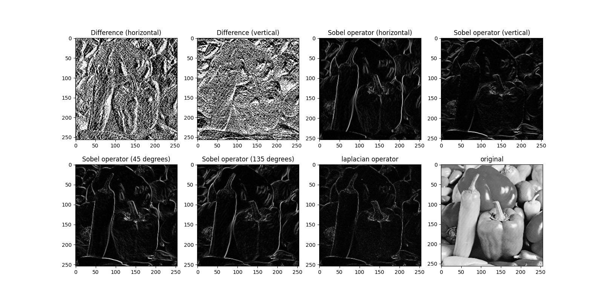
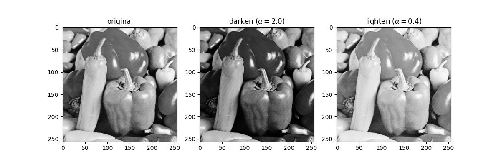

# Basic Signal and Image Processing Knowlidge (1)
## Introduction
A python implementation of  
1. edge detection(including difference, Sobel operator and laplacian operator)
2. Image Lightening and Darkening
3. Image Quality Assessment, IQA (including maximal error, MSE, NMSE, NRMSE, SNR, PSNR, SSIM)

## how to use
Using below command to run this code. 
<code>python3 demo.py --problem problem_no</code> 
Other argument is for changing setting parameter of algorithm 

* --print_out: {bool} export result or not?
* --file1: {string} dir of image for problem 1
* --file2: {string} dir of image for problem 2
* --mode: {string} 
* --alpha_1: {float} Lighten factor (must be smaller than 1)
* --alpha_2: {float} Darken factor (must be greater than 1)
* --file3_1: {string} dir of 1st image for problem 3
* --file3_2: {string} dir of 2nd image for problem 3

## Result
### problem 1

### problem 2
