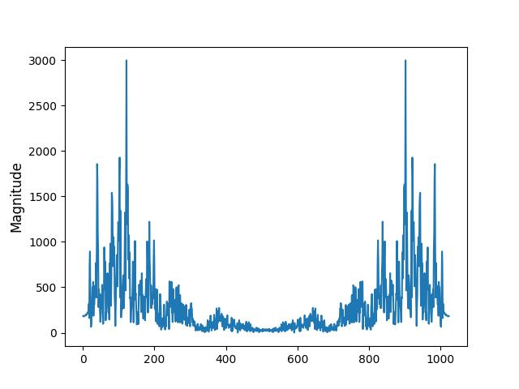
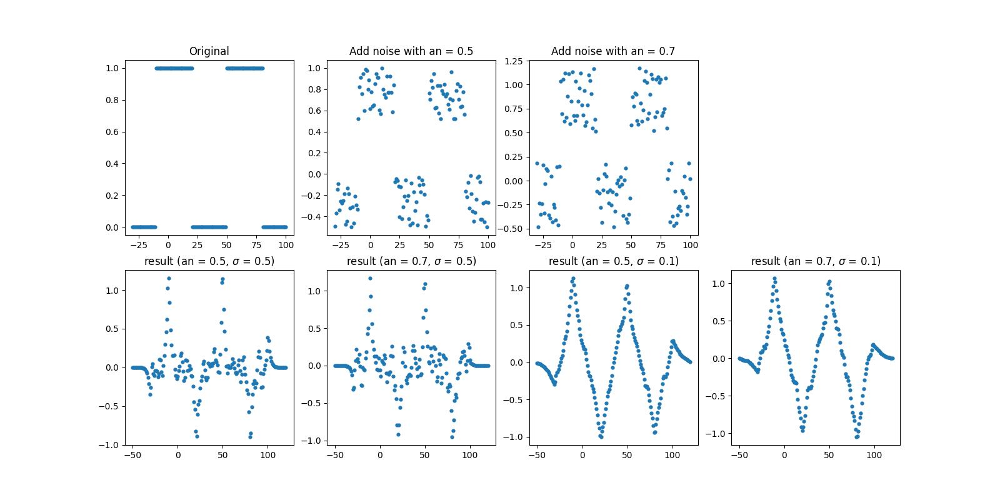
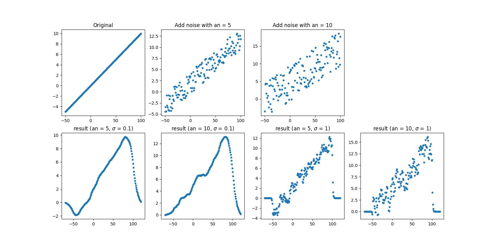

# Basic Signal and Image Processing Knowlidge (2)
## Introduction
A python implementation of  
1. Image Quality Assessment, IQA (including maximal error, MSE, NMSE, NRMSE, SNR, PSNR, SSIM)
2. Discrete Fourier Transform (DFT) on .wav file
3. Three edge detection filter
4. Two smooth filter
5. One feature extraction filter

## how to use
Using below command to run this code. 
<code>python3 demo.py --problem problem_no</code> 
Other argument is for changing setting parameter of algorithm 

* --print_out: {bool} export result or not?
* --file1_1: {string} dir of 1st image for problem 1
* --file1_1: {string} dir of 2nd image for problem 1
* --file2: {string} dir of image for problem 2
* --length: {int} length of signal for doing DFT
* --L3: {int} length of filter for problem 3
* --sig3_1: {float} 1st detecting scale for problem 3
* --sig3_2: {float} 2nd detecting scale for problem 3
* --noise_an3_1: {float} 1st noise amplitude for problem 3
* --noise_an3_2: {float} 2nd noise amplitude for problem 3
* --L4: {int} length of filter for problem 4
* --sig4_1: {float} 1st scale of feature for problem 4
* --sig4_2: {float} 2nd scale of feature for problem 4
* --noise_an4_1: {float} 1st noise amplitude for problem 4
* --noise_an4_1: {float} 2nd noise amplitude for problem 4

## Result
### problem 2

### problem 3

### problem 4
