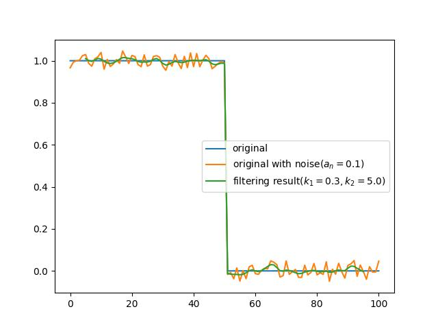
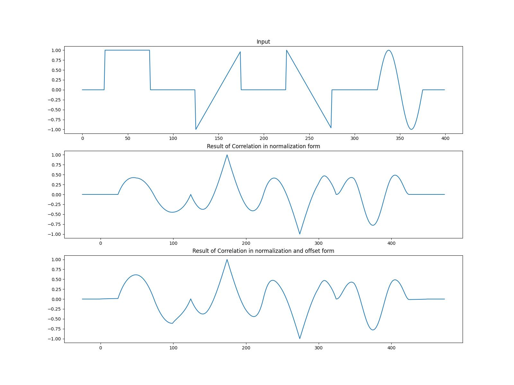
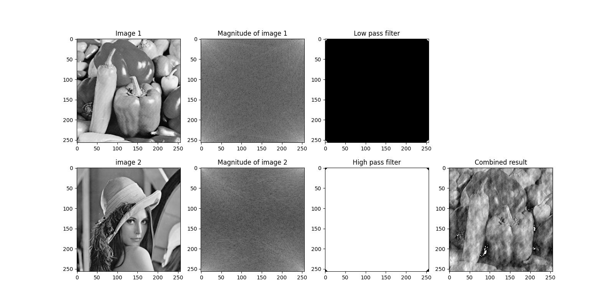
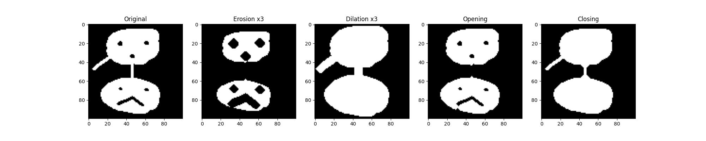

# Basic Signal and Image Processing Knowlidge (3)
## Introduction
A python implementation of  
1. 1-D bilateral filtering
2. Matched filter
3. Replace image's high frequency part with other's low frequency part.
4. Erosion、Dilation、Opening、Closing

## how to use
Using below command to run this code. 
<code>python3 demo.py --problem problem_no</code> 
Other argument is for changing setting parameter of algorithm 

* --print_out: {bool} export result or not?
* --noise_an1: {float} noise amplitude for problem 1
* --filter_length1: {int} length of bilateral filter
* --spatial_param: {float} parameter of spatial kernel
* --range_param: {float} parameter of range kernel
* --file3_1: {str} dir of 1st image for problem 3
* --file3_2: {str} dir of 2nd image for problem 3
* --threshold: {float} threshold of low/high pass filter
* --file4: {str} dir of image for problem 4

## Result
### problem 1

### problem 2

### problem 3

### problem 4

