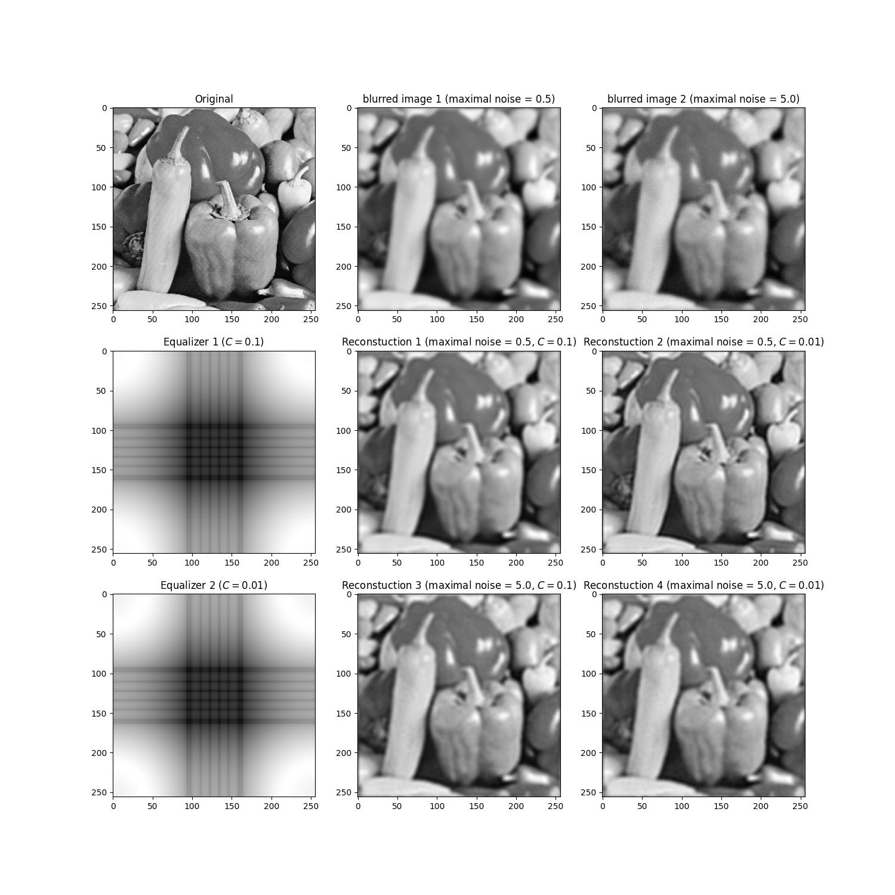

# Basic Signal and Image Processing Knowlidge (4)
## Introduction
A python implementation of  
1. Equlizer
2. PCA
3. Gram-Schmidt method

## how to use
Using below command to run this code. 
<code>python3 demo.py --problem problem_no</code> 
Other argument is for changing setting parameter of algorithm 

* --print_out: {bool} export result or not?
* --file1: {string} dir of image for problem 1
* --noise_level2_1: {float} 1st magnitude of two times average absolute noise
* --noise_level2_2: {float} 3nd magnitude of two times average absolute noise
* --C1: {float} Equlizer parameter 1
* --C2: {float} Equlizer parameter 2

## Result
### problem 1

### problem 4
